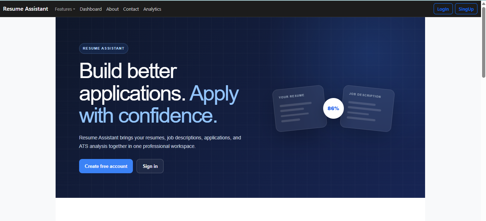
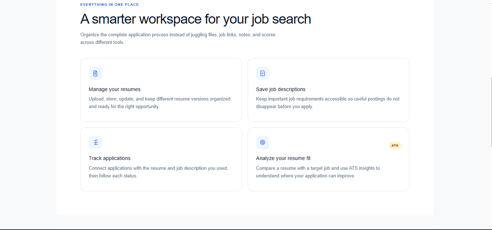
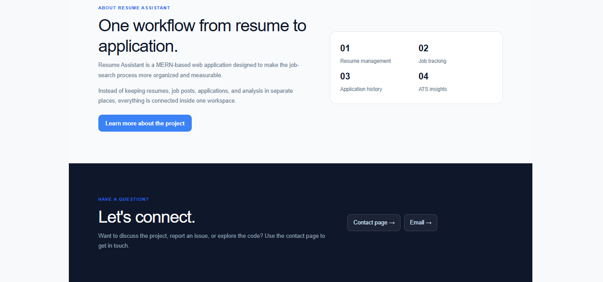
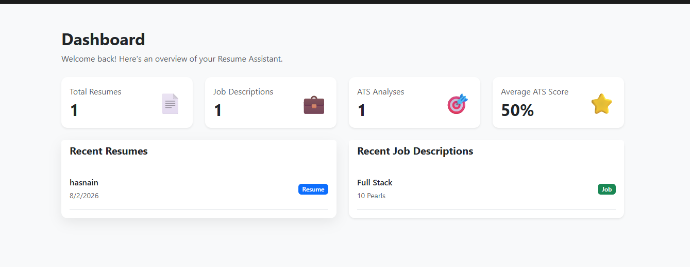
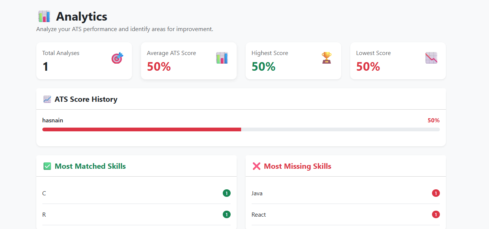
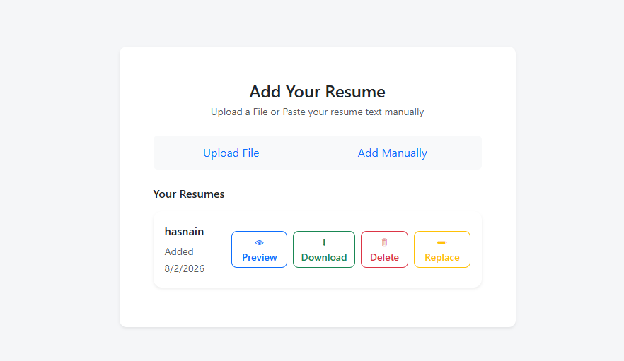
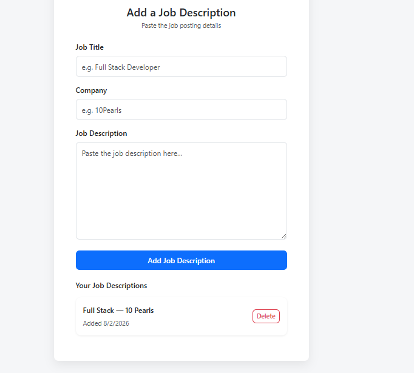
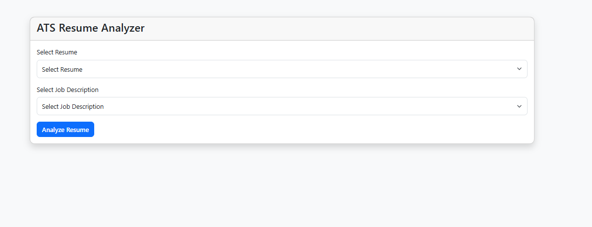

<div align="center">

# Resume Assistant

**A full-stack MERN workspace that brings your resumes, job descriptions, applications, and ATS analysis together in one place.**

[Live Demo](https://resumeassistant-lyart.vercel.app) · [Report an Issue](https://github.com/MSamimemon/Resume_Assistant/issues) · [Contact](#contact)

</div>

---

## Overview

Resume Assistant is designed to make the job-search process more organized and measurable. Instead of keeping resumes, job postings, applications, and ATS analysis scattered across different tools, everything lives inside one connected workspace — upload a resume, save a job description, run an ATS match, and track the application, all from a single dashboard.

## Features

- **Authentication** — secure signup/login with JWT tokens and bcrypt-hashed passwords
- **Resume Management** — upload a PDF/DOCX resume or paste text manually; preview, download, replace, or delete resumes
- **Job Description Tracking** — save job title, company, and full description for future matching
- **ATS Resume Analyzer** — select a resume and job description to generate a match score, with matched vs. missing skills broken down
- **Analytics Dashboard** — track average/highest/lowest ATS scores over time, plus most-matched and most-missing skills across all analyses
- **Application Dashboard** — an at-a-glance overview of total resumes, job descriptions, ATS analyses, and average score

## Screenshots

<table>
<tr>
<td width="50%">

**Landing Page**


</td>
<td width="50%">

**Features Overview**


</td>
</tr>
<tr>
<td width="50%">

**About & Contact**


</td>
<td width="50%">

**Dashboard**


</td>
</tr>
<tr>
<td width="50%">

**Analytics**


</td>
<td width="50%">

**Resume Management**


</td>
</tr>
<tr>
<td width="50%">

**Job Descriptions**


</td>
<td width="50%">

**Job Application**


</td>
<td width="50%">


**ATS Resume Analyzer**


</td >
<td width="50%">
</tr>
</table>

## Tech Stack

**Frontend**
- React 19, React Router
- Context API for state management (Resume, Job Description, ATS, Applications)
- Tailwind CSS + Bootstrap
- Craco (custom CRA configuration)

**Backend**
- Node.js + Express
- MongoDB Atlas + Mongoose
- JWT authentication, bcrypt password hashing
- Multer for file uploads
- pdf-parse for resume text extraction

**Deployment**
- Frontend → Vercel
- Backend → Render
- Database → MongoDB Atlas

## Project Structure

```
resume_assistant/
├── Backend/
│   ├── ATSService/        # Skill extraction, matching, and scoring logic
│   ├── Parse/              # Resume/job description text parsing
│   ├── Routes/             # API routes (auth, resume, jobdesc, ats, application, dashboard)
│   ├── models/              # Mongoose schemas
│   ├── middleware/          # Auth middleware, file upload handling
│   └── index.js              # Express app entry point
├── src/
│   ├── Components/           # React components/pages
│   ├── Context/               # Context API state management
│   └── App.js
└── public/
```

## Getting Started (Local Development)

### Prerequisites
- Node.js (v18+ recommended)
- A MongoDB connection string (local MongoDB or MongoDB Atlas)

### 1. Clone the repository
```bash
git clone https://github.com/MSamimemon/Resume_Assistant.git
cd Resume_Assistant/resume_assistant
```

### 2. Backend setup
```bash
cd Backend
npm nodemon .\index.js
```
Create a `.env` file in `Backend/` (see `.env.example` for reference):
```
PORT=5000
MONGO_URI=your_mongodb_connection_string
JWT_SECRET=your_jwt_secret
EMAIL_USER=your_email
EMAIL_PASS=your_email_app_password
FRONTEND_URL=http://localhost:3000
```

### 3. Frontend setup
```bash
cd ..
npm run start
```
Create a `.env` file in the project root:
```
REACT_APP_API_URL=http://localhost:5000
```

### 4. Run the app
```bash
cd ..
npm run this
```
The app runs at `http://localhost:3000`, with the API at `http://localhost:5000`.

## API Overview

| Route | Description |
|---|---|
| `/api/auth` | User signup, login |
| `/api/resume` | Upload and manage resumes |
| `/api/jobdesc` | Add and manage job descriptions |
| `/api/ats` | Run ATS analysis, view analysis history |
| `/api/application` | Track job applications |
| `/api/dashboard` | Dashboard statistics |


## Contact

- GitHub: [MSamimemon](https://github.com/MSamimemon)
- LinkedIn: [Muhammad Sami](https://www.linkedin.com/in/muhammad-sami-02a509351/)
